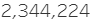
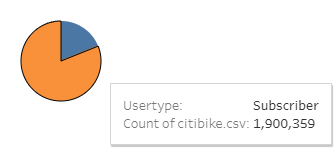
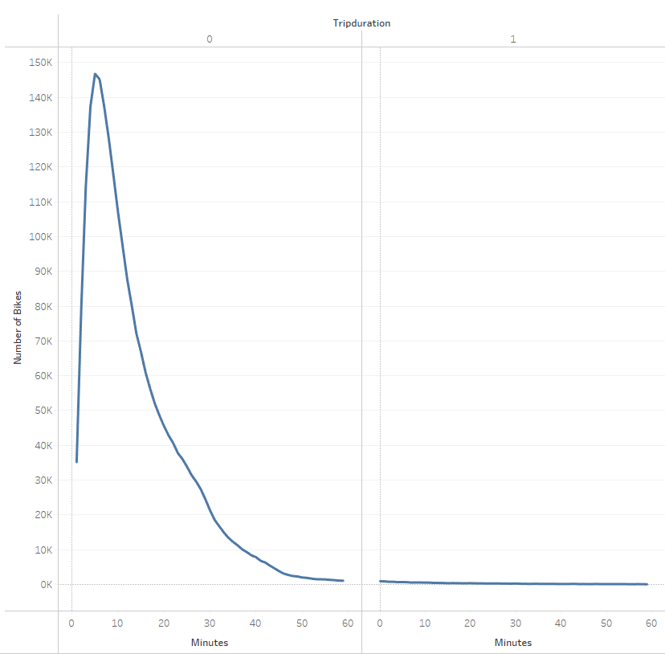
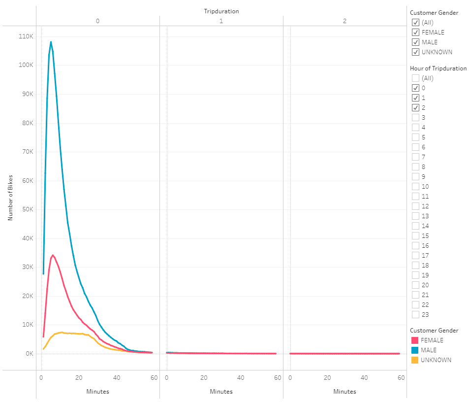
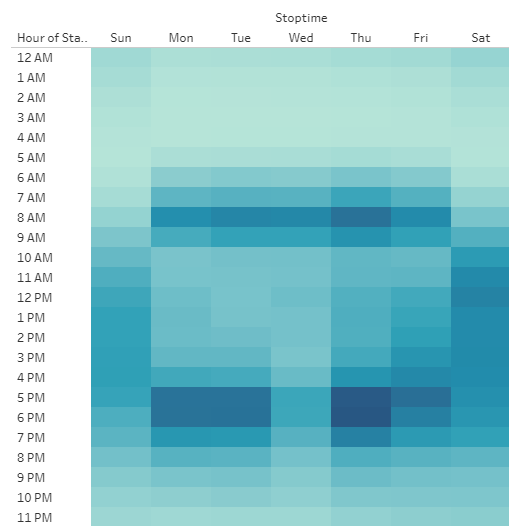
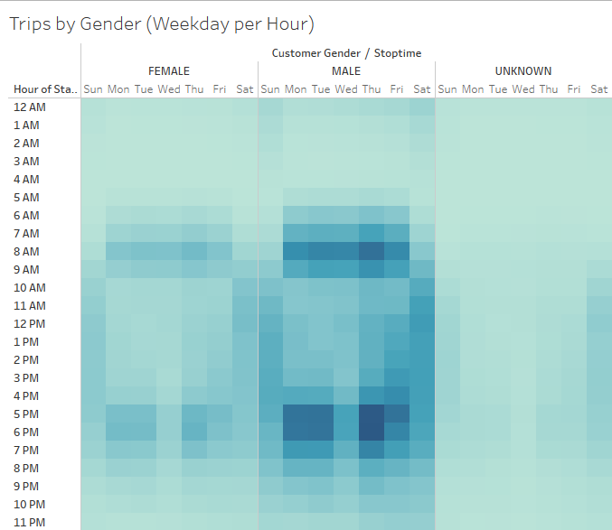
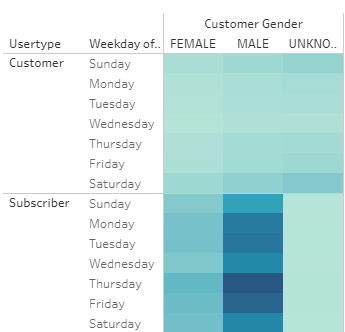

# bikesharing
# Analysis of NYC Citibike Bike Sharing Data 

## Overview of Data Analysis
> Analysis and visualization of customer metrics acquired by bike sharing company Citibike in August 2019 done through data manipulation in Python and PANDAS and visualizations in Tableau.
[link to dashboard](https://public.tableau.com/profile/christian.koehlinger#!/vizhome/NYCCitibikeChallenge_16209321059390/NYCCitibikeData "link to dashboard")

### Results
> Summary of Bikeshare Data

    - The total number of Citibike riders in NYC in August of 2019.

    - The majority of Citibike users are Subscribers.  

    - Very few rides last more than an hour.

    - Male customers tend to ride the longest.

    - On weekends, most rides are midday, whereas during the week rides are heavily concentrated during typical work commute times.

 

    - The gender of the customer does not have a significant impact on when rides occur. 

    - Citibike riders tend to be predominately male Subscribers. 

 

## Summary
> While the majority of Citibikes' customers are male, there seems to be little to no correlation between gender and popular ride times. Weekends see a steady flow of riders throughout the day and weekdays see heavy concentrations of riders in the early morning and in the evening, consistent with workday commute times. One notable gender difference is the length per ride, with males showing longer times. A possible factor in both the lower number of female riders and their tendency for shorter ride times could be related to how safe women feel riding a bike in this area. 

> Further analysis could be conducted through visualizations of the ages of customers compared to the ride frequency, time, and duration, as well as visualizations showing whether there is a noteable difference in weekday versus weekend riders who are Subscribers as opposed to regular customers. It seems likely that a large discrepancy would exists between riders and Subscribers on weekdays which are more planned in comparison to weekends where we would likely see a more mixed group of both customers and Subscribers. 